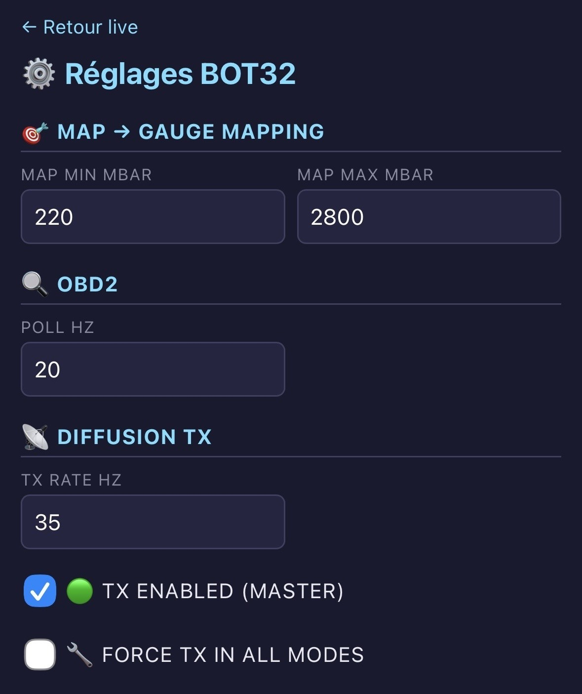
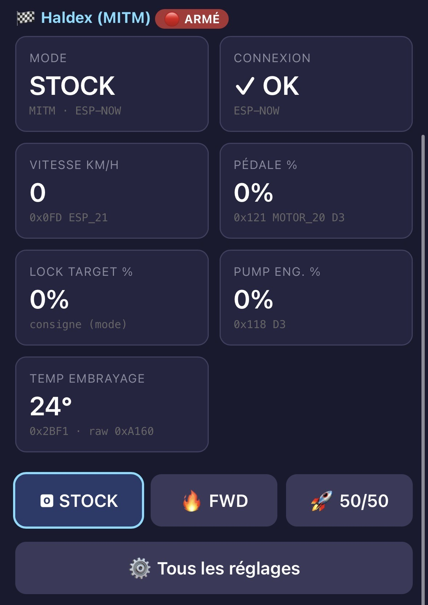
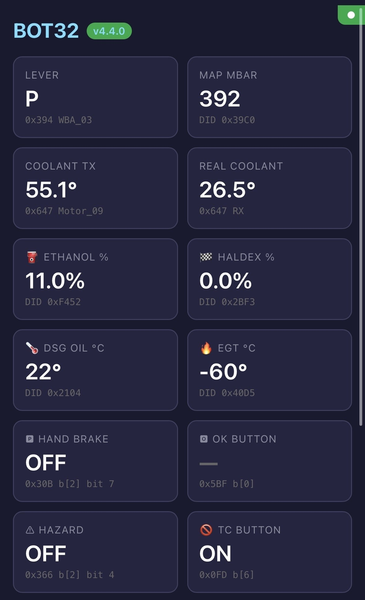
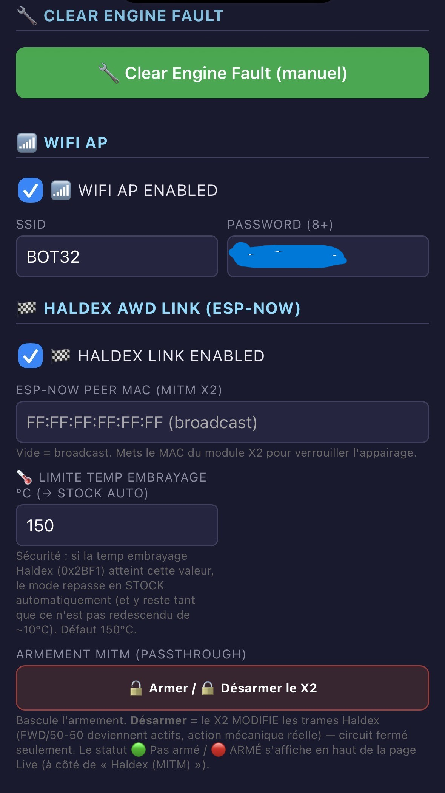

# BOT32 — Mobile UI screenshots

Captures de l'interface web mobile (servie par l'ESP32 Main sur son AP WiFi), v4.4.0.

| Capture | Description |
|---|---|
|  | **Réglages (haut)** — MAP → Gauge mapping, OBD2 (Poll Hz), Diffusion TX |
|  | **Live — Haldex (MITM)** — badge armé 🟢/🔴, mode, vitesse/pédale, lock target, pump %, **temp embrayage + raw 0x2BF1**, boutons STOCK/FWD/50-50 |
|  | **Live — grille principale** — lever, MAP, coolant TX/réel, éthanol, Haldex %, DSG/EGT, sniffers (frein à main, OK, hazard, TC) |
|  | **Réglages (bas)** — bouton Clear Engine Fault, WiFi AP (mot de passe masqué), Haldex link (MAC, **limite temp embrayage**, Armer/Désarmer) |
